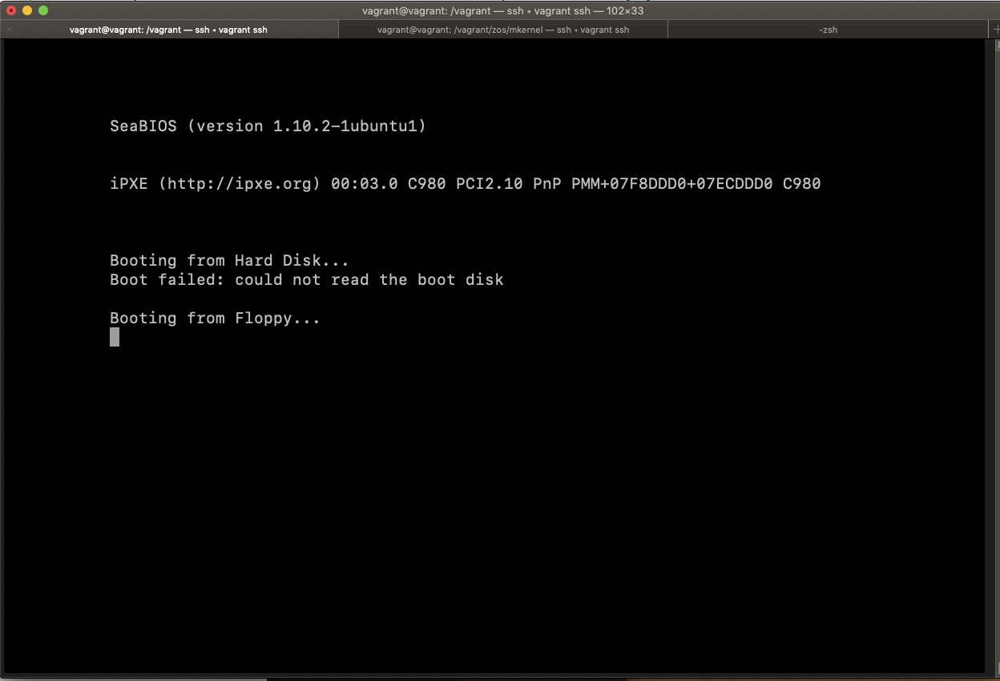
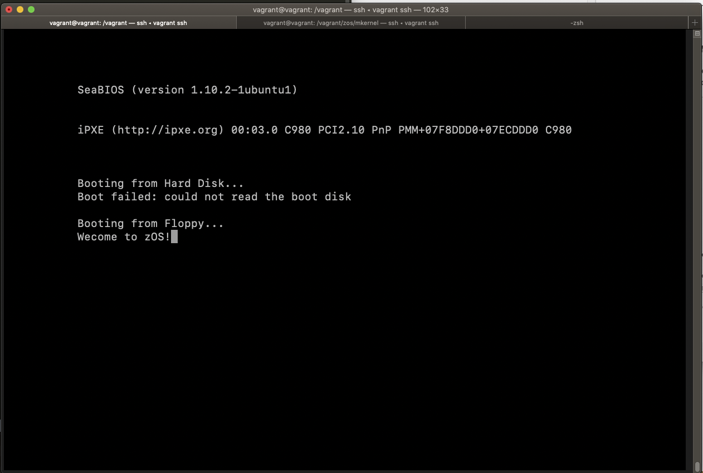
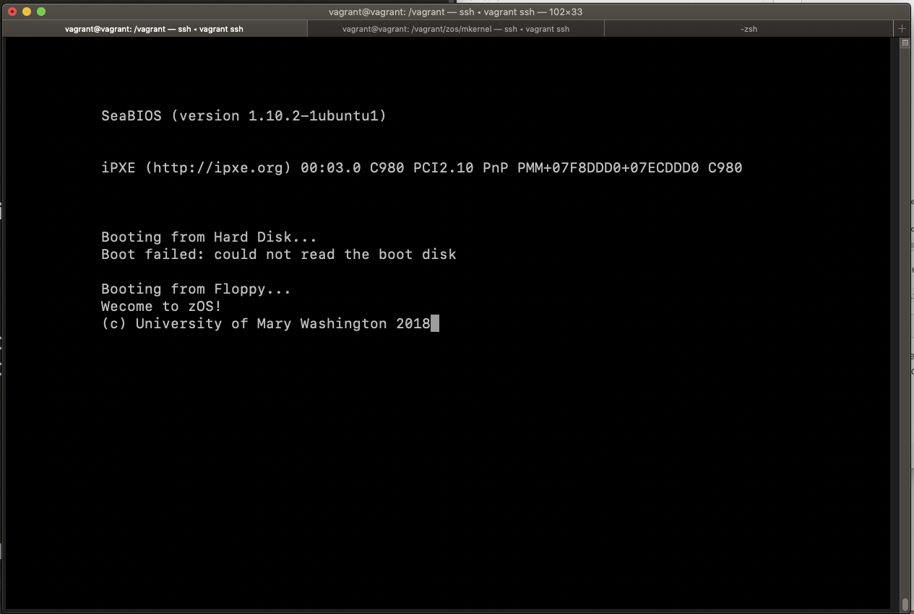

# The boot loader

## Part 1 - Pressing the power button on your laptop.
You would think a power button, by definition, would turn the power on and off, but in fact the power button is programmable. It may just put your computer to sleep. In fact there are exploits that take advantage of this. For example, the Blue Pill Exploit won't survive a hard reboot but it simply takes over the power button and fakes a reboot. 

That said, I am going to start with the notion that a power button actually turns on the power to your laptop and my question is what happens when you press that power button? Here is what happens.

Well, before we get to that let us first talk about ...

### The BIOS
On the motherboard there is a flash memory chip called the BIOS (Basic Input Output System). Sometimes the manufacturer of the laptop or motherboard will release an update to the BIOS and you can "flash the BIOS" with the update -- meaning your replace the contents of that memory chip with the new data. I am sure most of you have seen a BIOS configuration screen. Often you can gain access to it by pressing the delete key on bootup.  On the configuration screen you can specify things like the boot order of the drives, fan speed, and possibly the core speed of the CPU.  

So, what happens when we press the power button.

1. The button turns on the power supply of the computer. For a laptop it connects the battery to the motherboard. So now the motherboard and all the components on it are powered.
2. The computer tests all the hardware components to make sure they are okay. This is called the power on self test or POST, which is a small program within the BIOS. It checks the RAM. It checks for a keyboard and mouse. If it finds something wrong it beeps a particular code.
3. Code on the BIOS displays information on the attached monitor This includes the BIOS manufacturer, processor specs, amount of RAM detected, and drives connected. Most laptop manufacturers hid this information behind a spash screen. You can turn off the spash screen in the BIOS to get all the details.
4. The BIOS code attempts to load the first sector of the boot disk...

Amazingly enough, that is the high level description of what happens. Let's get a more detailed look.

### The details

### 1. you press the power button and the motherboard gets power.
Part of this process is that the CPU gets power.

### 2. The CPU wakes up
(ok I am anthropomorphizing the CPU). When an Intel CPU gets power, predefined values are entered into the CPU registers including

     IP           0xfff0
     CS selector  0xf000
     CS base      0xffff0000
     
Many of you used the Raspberry Pi in your architecture class, which is nice and clean, so you may not enjoy this part too much. The Intel 8086 was developed in 1976. To maintain backward compatibility (not a bad thing in general) even with their last Core X processors with 18 cores. This leads to some wonkiness that we need to deal with.

### 3. Real Mode
When an Intel processor starts--even the latest and greatest Intel processor--, it is in [real mode]9https://en.wikipedia.org/wiki/Real_mode). The Intel 8086 had a 20-bit address bus. Now let me ask you this. How much memory can that bus address? Pause, do some mental calisthenics, and figure it out .....

     .
     .
     .
     .
     .
     .
     .
     .
     .
     
If you though 2^20 or 1,048,576 or 1 megabyte you would be correct. So when you high priced laptop with 16gb of memory first starts, it can only access 1MB of memory. That is sort of a bummer. But it gets worse. The registers on an 8086 were only 16 bits--so 2^16 or 64k of memory.

> side note: [my first computer](https://en.wikipedia.org/wiki/ZX80) had 2k of memory and my second had 64k

So the 8086 address bus was 20 bits but the registers were 16 so they came up with idea of [memory segmentation](https://en.wikipedia.org/wiki/Memory_segmentation).  In this scheme the physical memory was divided into segments that were 2^16 or 65536 bytes or 64KB. So accessing a particular memory location was a two part process. First we identify which segment we are interested in. This is called the `segment selector` in the `CS selector` register. Second, we identify where in that segment is the memory we are interested in(the `offset` in the `IP` register) .  So if

	IP = 0x1111
	CS = 0x2000
	
then the actual physical address is 

	>>> hex((0x2000 << 4) + 0x1111)
    '0x21111'

In other words

	physicalAddress = Segment Selector * 16 + Offset

The `CS` register has two parts. The `CS selector` is something you can change--it is visible. The `CS base` part of the register is automatically computed. It is simply the `CS selector` * 16. So the process is

1. let the `CS base` be `CS sector` * 16
2. let the actual address be `CS base` + the contents of `IP`	
This is exactly how things work when running merrily along but it is not how it works when we boot the computer. As shown above which we repeat here

        IP           0xfff0
        CS selector  0xf000
        CS base      0xffff0000
   
  when your laptop powers up, the `CS Base` is filled with a hard coded number.  The CPU will use this hard coded number until `CS selector` is changed.
  
In this case we get. So the first instruction the CPU will execute will be at address:

	0xfff0000 + 0xfff0 = 	0xfffffff0
	
which is 16 bytes below 4GB. This is called the [reset vector](https://en.wikipedia.org/wiki/Reset_vector)  and contains a jump instruction to the code in the BIOS.

### 4. Now the BIOS starts
After initializing and checking hardware the BIOS code needs to find a bootable device. It does this by checking the boot order in the BIOS configuration. The BIOS tries to find a boot sector. The boot sector is 512 bytes long and the final two bytes are the [magic numbers](https://en.wikipedia.org/wiki/Magic_number_(programming))  `0x55` and `0xaa`, which indicates to the BIOS that this device is bootable. If the BIOS finds that the device is bootable, the contents of the boot sector are loaded into memory and executed.

# Creating our own bootloader

> This section is from Eugene Obrezkov's tutorial, How to implement your own “Hello, World!” boot loader

So what does that 512 byte boot sector contain?  That sector contains a small program that will load the operating system. This program is called the **bootloader**. The bootloader is written in assembly. To create one we will need both an assembler `nasm`, and an emulator `qemu`. These are both included in the Vagrantfile for this class. 

### Question
How does the program in BIOS know that a disk has an executable bootloader?

     .
     .
     .
     
As mentioned above, a boot sector is indicated by the magic numbers `0x55` and `0xAA` located at bytes 511 and 512 of the boot sector.  So the basic framework for a minimal bootloader is:

	; Our code
	jmp $
	; Magic Numbers
	times 510 - ($ - $$) db 0
	dw 0xAA55

The `$` represents the address of the current instruction. So

	jmp $
	
is jumping to its address for the next instruction which creates an infinite loop.

Now the next instruction

	times 510 - ($ - $$) db 0

 `times` is an assembler psuedo instruction that causes the instruction to be assembled multiple times. For example
 
	zerobuf: times 64 db 0
	
results in zero be written to 64 consecutive bytes. (`db` is another psuedo instruction.)	
`$$` represents the first address of the section.  So `$ - $$` represents how many bytes the code above this line took. So

	times 510 - ($ - $$) db 0
	
puts 0 in the rest of file up to and including byte 510.

Finally

	dw 0XAA55
	
writes `0x55` and `0xAA` as the last 2 bytes of the file.
	
Now we will compile the assembly file `boot.asm`:

	nasm boot.asm -f bin -o boot.bin
	
And run the file using qemu:

	qemu-system-i386 -curses -fda boot.bin
	
You should see something like

## Printing the name of our OS
Since we have a primitive working `boot.asm` let's modify it to print a welcome message. Here is the code.

    org 0x7C00                      ; BIOS loads our program at this address
	bits 16                         ; We're working at 16-bit mode here

	start:
		cli                     ; Disable the interrupts
		mov si, msg             ; SI now points to our message
		mov ah, 0x0E            ; Indicate BIOS we're going to print chars
	.loop	lodsb                   ; Loads SI into AL and increments SI [next char]
		or al, al               ; Checks if the end of the string
		jz halt                 ; Jump to halt if the end
		int 0x10                ; Otherwise, call interrupt for printing the char
		jmp .loop               ; Next iteration of the loop

	halt:	hlt                     ; CPU command to halt the execution
	msg:	db "Welcome to zOS!", 0   ; Our actual message to print

	;; TODO Write Magic numbers

You need to complete the code in the todo section.

As you may know the `int` in

	int 0x10
	
does not stand for integer but rather interrupt. Interrupt `0x10` writes the character in register `al` to the video display.

When we compile it and run it in qemu we get:

## You try
Can you modify the program so that it prints two lines? For example,

hint 1. To get the cursor to another line you should print carriage return followed by a line feed.

hint 2.  The code `msg:	db "Wecome to zOS!",0x09, 0x09, 0 ` would end our message with two tabs (`0x09` represents a tab in ASCII).

ß